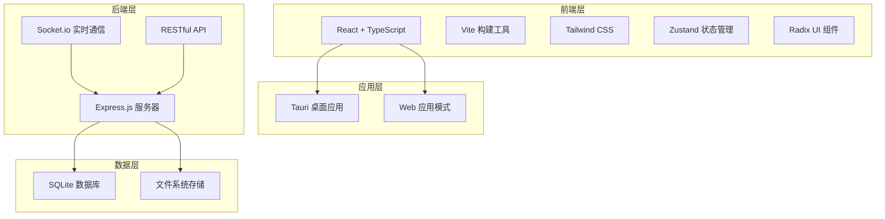
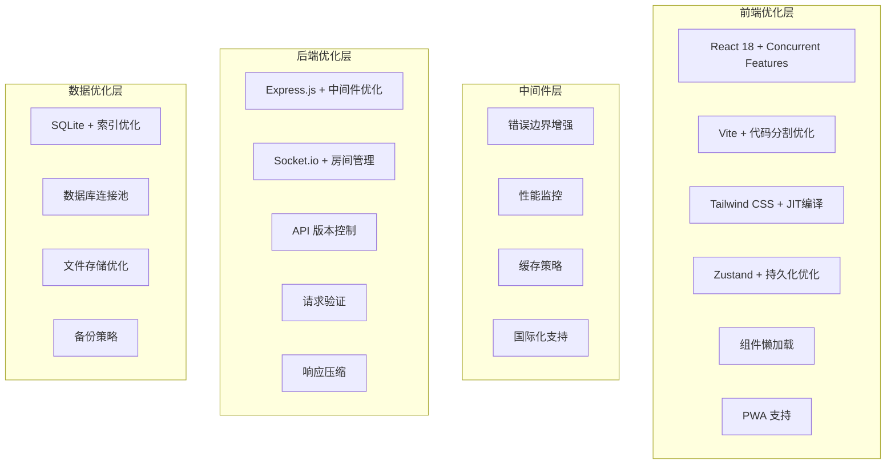

# 应用优化设计文档

## 概述

本设计文档基于对CMS内容创作平台的深入分析，提出了一套全面的优化方案。该方案旨在提高应用程序的性能、安全性、可维护性和用户体验，同时保持现有功能的完整性。

## 架构设计

### 当前架构分析



### 优化后的架构设计



## 组件和接口设计

### 1. 前端组件架构优化

#### 组件层次结构
```
src/
├── components/
│   ├── layout/           # 布局组件
│   │   ├── Sidebar.tsx
│   │   ├── Topbar.tsx
│   │   └── MainContent.tsx
│   ├── modules/          # 功能模块组件
│   │   ├── products/     # 产品管理
│   │   ├── templates/    # 模板管理
│   │   ├── assets/       # 素材管理
│   │   ├── charts/       # 图表组件
│   │   └── editor/       # 编辑器组件
│   ├── ui/               # 基础UI组件
│   └── common/           # 通用组件
├── hooks/                # 自定义Hooks
├── utils/                # 工具函数
├── services/             # API服务
├── stores/               # 状态管理
└── types/                # TypeScript类型定义
```

#### 组件优化策略
1. **懒加载实现**
   - 使用React.lazy()和Suspense
   - 路由级别的代码分割
   - 组件级别的按需加载

2. **性能优化**
   - React.memo()防止不必要的重渲染
   - useMemo()和useCallback()优化计算
   - 虚拟滚动处理大列表

3. **错误处理**
   - 错误边界组件增强
   - 全局错误处理机制
   - 用户友好的错误提示

### 2. 状态管理优化

#### Zustand Store 结构优化
```typescript
interface OptimizedAppStore {
  // 应用状态
  app: {
    isLoading: boolean;
    error: string | null;
    theme: 'light' | 'dark' | 'auto';
    language: string;
  };
  
  // 用户状态
  user: {
    profile: UserProfile | null;
    preferences: UserPreferences;
    permissions: Permission[];
  };
  
  // 数据状态
  data: {
    products: Product[];
    templates: Template[];
    assets: Asset[];
    charts: Chart[];
  };
  
  // UI状态
  ui: {
    sidebarCollapsed: boolean;
    currentModule: string;
    selectedItems: string[];
  };
  
  // 缓存状态
  cache: {
    lastUpdated: Record<string, number>;
    invalidationKeys: string[];
  };
}
```

#### 状态管理优化策略
1. **数据规范化**
   - 使用实体-关系模式
   - 避免深层嵌套结构
   - 实现高效的数据更新

2. **缓存策略**
   - 实现智能缓存机制
   - 缓存失效策略
   - 离线数据支持

3. **持久化优化**
   - 选择性数据持久化
   - 压缩存储数据
   - 版本迁移支持

### 3. API接口设计优化

#### RESTful API 结构
```
/api/v1/
├── /auth/              # 认证相关
│   ├── POST /login
│   ├── POST /logout
│   └── GET /profile
├── /products/          # 产品管理
│   ├── GET /products
│   ├── POST /products
│   ├── PUT /products/:id
│   └── DELETE /products/:id
├── /templates/         # 模板管理
├── /assets/           # 素材管理
├── /charts/           # 图表管理
└── /upload/           # 文件上传
```

#### API优化策略
1. **版本控制**
   - 实现API版本管理
   - 向后兼容性保证
   - 渐进式升级策略

2. **性能优化**
   - 响应数据压缩
   - 分页和过滤支持
   - 缓存头设置

3. **安全增强**
   - JWT令牌认证
   - 请求速率限制
   - 输入验证和清理

## 数据模型设计

### 数据库架构优化

#### 优化后的表结构
```sql
-- 用户表
CREATE TABLE users (
    id TEXT PRIMARY KEY,
    username TEXT UNIQUE NOT NULL,
    email TEXT UNIQUE,
    password_hash TEXT NOT NULL,
    role TEXT DEFAULT 'user',
    preferences TEXT, -- JSON
    created_at DATETIME DEFAULT CURRENT_TIMESTAMP,
    updated_at DATETIME DEFAULT CURRENT_TIMESTAMP,
    INDEX idx_username (username),
    INDEX idx_email (email)
);

-- 产品表（优化索引）
CREATE TABLE products (
    id TEXT PRIMARY KEY,
    name TEXT NOT NULL,
    brand TEXT,
    category TEXT,
    price REAL,
    description TEXT,
    features TEXT, -- JSON
    specifications TEXT, -- JSON
    images TEXT, -- JSON
    tags TEXT, -- JSON
    status TEXT DEFAULT 'active',
    created_at DATETIME DEFAULT CURRENT_TIMESTAMP,
    updated_at DATETIME DEFAULT CURRENT_TIMESTAMP,
    INDEX idx_category (category),
    INDEX idx_brand (brand),
    INDEX idx_status (status),
    INDEX idx_created_at (created_at)
);

-- 模板表
CREATE TABLE templates (
    id TEXT PRIMARY KEY,
    name TEXT NOT NULL,
    description TEXT,
    content TEXT NOT NULL,
    category TEXT,
    tags TEXT, -- JSON
    is_public BOOLEAN DEFAULT true,
    usage_count INTEGER DEFAULT 0,
    created_by TEXT,
    created_at DATETIME DEFAULT CURRENT_TIMESTAMP,
    updated_at DATETIME DEFAULT CURRENT_TIMESTAMP,
    FOREIGN KEY (created_by) REFERENCES users(id),
    INDEX idx_category (category),
    INDEX idx_public (is_public),
    INDEX idx_usage (usage_count)
);
```

#### 数据模型优化策略
1. **索引优化**
   - 为常用查询字段添加索引
   - 复合索引优化
   - 定期索引维护

2. **数据完整性**
   - 外键约束
   - 数据验证规则
   - 事务处理

3. **性能优化**
   - 查询优化
   - 连接池管理
   - 数据分页

## 错误处理策略

### 前端错误处理
```typescript
// 全局错误边界
class GlobalErrorBoundary extends React.Component {
  constructor(props) {
    super(props);
    this.state = { hasError: false, error: null };
  }

  static getDerivedStateFromError(error) {
    return { hasError: true, error };
  }

  componentDidCatch(error, errorInfo) {
    // 错误日志记录
    this.logError(error, errorInfo);
    
    // 错误报告
    this.reportError(error, errorInfo);
  }

  render() {
    if (this.state.hasError) {
      return <ErrorFallback error={this.state.error} />;
    }

    return this.props.children;
  }
}
```

### 后端错误处理
```javascript
// 统一错误处理中间件
const errorHandler = (error, req, res, next) => {
  // 错误日志记录
  logger.error({
    error: error.message,
    stack: error.stack,
    url: req.url,
    method: req.method,
    ip: req.ip,
    userAgent: req.get('User-Agent')
  });

  // 错误响应
  const statusCode = error.statusCode || 500;
  const message = process.env.NODE_ENV === 'production' 
    ? '服务器内部错误' 
    : error.message;

  res.status(statusCode).json({
    success: false,
    message,
    timestamp: new Date().toISOString(),
    requestId: req.id
  });
};
```

## 测试策略

### 测试架构
```
tests/
├── unit/               # 单元测试
│   ├── components/     # 组件测试
│   ├── hooks/          # Hook测试
│   ├── utils/          # 工具函数测试
│   └── services/       # 服务测试
├── integration/        # 集成测试
│   ├── api/            # API测试
│   └── database/       # 数据库测试
├── e2e/               # 端到端测试
│   ├── user-flows/     # 用户流程测试
│   └── performance/    # 性能测试
└── fixtures/          # 测试数据
```

### 测试工具选择
1. **单元测试**: Jest + React Testing Library
2. **集成测试**: Supertest + Jest
3. **端到端测试**: Playwright
4. **性能测试**: Lighthouse CI

## 性能优化策略

### 前端性能优化
1. **代码分割**
   - 路由级别分割
   - 组件级别分割
   - 第三方库分割

2. **资源优化**
   - 图片懒加载
   - 资源预加载
   - CDN使用

3. **渲染优化**
   - 虚拟滚动
   - 防抖和节流
   - 内存泄漏防护

### 后端性能优化
1. **数据库优化**
   - 查询优化
   - 索引优化
   - 连接池管理

2. **缓存策略**
   - Redis缓存
   - 内存缓存
   - HTTP缓存

3. **服务器优化**
   - 响应压缩
   - 静态资源优化
   - 负载均衡

## 安全性设计

### 安全措施
1. **认证和授权**
   - JWT令牌认证
   - 角色基础访问控制
   - 会话管理

2. **数据保护**
   - 输入验证
   - SQL注入防护
   - XSS防护

3. **传输安全**
   - HTTPS强制
   - CORS配置
   - CSP策略

## 国际化设计

### 国际化架构
```typescript
// 国际化配置
interface I18nConfig {
  defaultLocale: string;
  locales: string[];
  fallbackLocale: string;
  resources: Record<string, Record<string, string>>;
}

// 国际化Hook
const useTranslation = (namespace?: string) => {
  const { locale, setLocale } = useI18nStore();
  
  const t = useCallback((key: string, params?: Record<string, any>) => {
    return translate(key, params, locale, namespace);
  }, [locale, namespace]);
  
  return { t, locale, setLocale };
};
```

### 本地化支持
1. **文本本地化**
   - 多语言文本支持
   - 动态语言切换
   - 文本插值支持

2. **格式本地化**
   - 日期时间格式
   - 数字货币格式
   - 地址格式

3. **文化适应**
   - RTL语言支持
   - 文化色彩适应
   - 本地化图标

## 部署和监控

### 部署策略
1. **容器化部署**
   - Docker容器
   - Docker Compose
   - Kubernetes支持

2. **CI/CD流程**
   - 自动化测试
   - 自动化部署
   - 回滚策略

### 监控和日志
1. **性能监控**
   - 应用性能监控
   - 用户体验监控
   - 错误监控

2. **日志管理**
   - 结构化日志
   - 日志聚合
   - 日志分析

## 总结

本设计文档提供了一个全面的应用优化方案，涵盖了架构设计、组件优化、数据模型、错误处理、测试策略、性能优化、安全性和国际化等各个方面。通过实施这些优化措施，可以显著提高应用程序的质量、性能和用户体验。