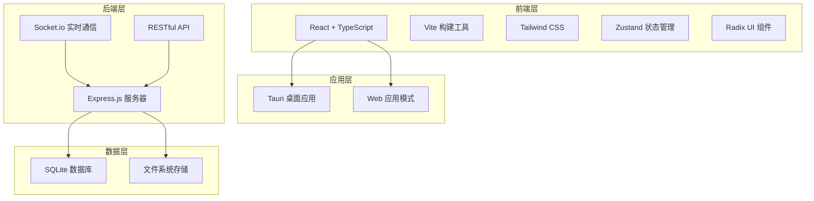

# CMS内容创作平台开发计划书

## 1. 项目概述

### 1.1 项目简介

CMS内容创作平台是一个基于React + TypeScript +
Tauri构建的智能内容创作系统，专为产品内容管理而设计。该平台支持桌面应用和Web应用双模式，提供富文本编辑、数据可视化、实时协作等功能，满足企业级内容管理需求。

### 1.2 项目目标

- 构建一个高效、易用的内容创作与管理平台
- 支持多人协作的内容编辑环境
- 提供数据可视化和富媒体内容支持
- 实现跨平台（Web和桌面）的统一体验
- 确保系统安全性、可扩展性和高性能

## 2. 技术架构

### 2.1 技术栈

#### 前端

- **框架**: React 18 + TypeScript
- **构建工具**: Vite
- **样式**: Tailwind CSS + CSS Modules
- **状态管理**: Zustand
- **UI组件**: Radix UI
- **动画**: Framer Motion
- **图标**: Lucide React

#### 后端

- **运行时**: Node.js + Express
- **数据库**: SQLite
- **实时通信**: Socket.io
- **文件上传**: Multer
- **安全**: Helmet + CORS + Rate Limiting

#### 桌面应用

- **框架**: Tauri
- **语言**: Rust + TypeScript

### 2.2 系统架构



### 2.3 项目结构

```
cms-content-creator/
├── src/                    # 前端源码
│   ├── components/         # React组件
│   │   ├── layout/        # 布局组件
│   │   ├── modules/       # 功能模块
│   │   └── ui/            # 基础UI组件
│   ├── hooks/             # 自定义Hooks
│   ├── services/          # API服务
│   ├── stores/            # 状态管理
│   ├── types/             # TypeScript类型
│   └── utils/             # 工具函数
├── server/                # 后端服务器
│   ├── routes/            # API路由
│   ├── database.js        # 数据库配置
│   └── index.js           # 服务器入口
├── src-tauri/             # Tauri配置
├── public/                # 静态资源
├── data/                  # 数据库文件
├── uploads/               # 上传文件
└── dist/                  # 构建输出
```

## 3. 功能模块

### 3.1 核心功能

#### 产品管理模块

- 产品信息录入与编辑
- 产品分类管理（支持三级分类）
- 产品批量操作（导入/导出/删除）
- 产品搜索与筛选

#### 内容编辑模块

- 富文本编辑器（TinyMCE/Quill）
- 模板系统（创建/使用/管理）
- 内容版本控制
- 多媒体内容支持

#### 数据可视化模块

- 图表生成（柱状图/饼图/折线图等）
- 数据导入与处理
- 图表样式自定义
- 图表导出与嵌入

#### 素材管理模块

- 素材上传与分类
- 素材库管理
- 素材搜索与筛选
- 素材使用追踪

#### 协作功能模块

- 实时多人协作
- 用户权限管理
- 操作历史记录
- 通知与消息系统

### 3.2 技术特性

- 响应式设计，支持多端适配
- PWA支持，实现类原生APP体验
- 离线数据支持
- 数据自动备份与恢复
- 高性能渲染与数据处理

## 4. 数据模型设计

### 4.1 数据库表结构

```sql
-- 用户表
CREATE TABLE users (
    id TEXT PRIMARY KEY,
    username TEXT UNIQUE NOT NULL,
    email TEXT UNIQUE,
    password_hash TEXT NOT NULL,
    role TEXT DEFAULT 'user',
    preferences TEXT, -- JSON
    created_at DATETIME DEFAULT CURRENT_TIMESTAMP,
    updated_at DATETIME DEFAULT CURRENT_TIMESTAMP
);

-- 产品表
CREATE TABLE products (
    id TEXT PRIMARY KEY,
    name TEXT NOT NULL,
    brand TEXT,
    category TEXT,
    price REAL,
    description TEXT,
    features TEXT, -- JSON
    specifications TEXT, -- JSON
    images TEXT, -- JSON
    tags TEXT, -- JSON
    status TEXT DEFAULT 'active',
    created_at DATETIME DEFAULT CURRENT_TIMESTAMP,
    updated_at DATETIME DEFAULT CURRENT_TIMESTAMP
);

-- 模板表
CREATE TABLE templates (
    id TEXT PRIMARY KEY,
    name TEXT NOT NULL,
    description TEXT,
    content TEXT NOT NULL,
    category TEXT,
    tags TEXT, -- JSON
    is_public BOOLEAN DEFAULT true,
    usage_count INTEGER DEFAULT 0,
    created_by TEXT,
    created_at DATETIME DEFAULT CURRENT_TIMESTAMP,
    updated_at DATETIME DEFAULT CURRENT_TIMESTAMP,
    FOREIGN KEY (created_by) REFERENCES users(id)
);
```

### 4.2 API接口设计

```
/api/v1/
├── /auth/              # 认证相关
│   ├── POST /login
│   ├── POST /logout
│   └── GET /profile
├── /products/          # 产品管理
│   ├── GET /products
│   ├── POST /products
│   ├── PUT /products/:id
│   └── DELETE /products/:id
├── /templates/         # 模板管理
├── /assets/           # 素材管理
├── /charts/           # 图表管理
└── /upload/           # 文件上传
```

## 5. 开发计划

### 5.1 开发阶段

#### 阶段一：基础架构搭建（2周）

- 项目初始化与配置
- 前端框架搭建
- 后端服务器搭建
- 数据库设计与实现
- 基础API开发

#### 阶段二：核心功能开发（4周）

- 产品管理模块
- 内容编辑模块
- 素材管理模块
- 用户认证与权限
- 基础UI组件开发

#### 阶段三：高级功能开发（3周）

- 数据可视化模块
- 模板系统
- 实时协作功能
- 离线数据支持
- 数据导入导出

#### 阶段四：桌面应用开发（2周）

- Tauri集成
- 桌面特定功能开发
- 跨平台测试
- 打包与发布

#### 阶段五：测试与优化（2周）

- 单元测试
- 集成测试
- 性能优化
- 安全性测试
- 用户体验优化

### 5.2 里程碑

1. **基础架构完成** - 项目框架搭建完毕，可进行基础开发
2. **核心功能可用** - 产品管理、内容编辑等核心功能可用
3. **Web版本发布** - Web应用版本完成并可部署
4. **桌面版本发布** - 桌面应用版本完成并可分发
5. **正式版发布** - 完整功能测试通过，正式版发布

## 6. 部署策略

### 6.1 混合部署方案

#### Web应用部署

- **快速部署**：1-2周内完成
- **目标用户**：体验用户，提供80%核心功能
- **部署平台**：Vercel/Netlify或自有服务器
- **访问方式**：浏览器访问

#### 桌面应用部署

- **开发周期**：2-3周完成
- **目标用户**：专业用户，提供100%完整功能
- **支持平台**：Windows、macOS、Linux
- **分发渠道**：官网下载、应用商店

### 6.2 部署环境要求

#### 服务器环境（Web版）

- **推荐配置**：
  - CPU: 2核心以上
  - 内存: 2GB以上
  - 硬盘: 20GB以上SSD
  - 带宽: 1Mbps以上
  - 系统: Ubuntu 20.04 LTS

#### 客户端环境（桌面版）

- **最低配置**：
  - CPU: 双核处理器
  - 内存: 4GB RAM
  - 硬盘: 500MB可用空间
  - 系统: Windows 10/11, macOS 10.15+, Ubuntu 18.04+

## 7. 测试策略

### 7.1 测试类型

- **单元测试**：使用Jest + React Testing Library
- **集成测试**：使用Supertest + Jest
- **端到端测试**：使用Playwright
- **性能测试**：使用Lighthouse CI

### 7.2 测试覆盖范围

- 组件渲染与交互
- API接口功能
- 数据库操作
- 用户流程测试
- 跨浏览器兼容性
- 响应式布局测试

## 8. 优化策略

### 8.1 前端优化

- **代码分割**：路由级别和组件级别的代码分割
- **资源优化**：图片懒加载、资源预加载、CDN使用
- **渲染优化**：虚拟滚动、防抖和节流、内存泄漏防护

### 8.2 后端优化

- **数据库优化**：查询优化、索引优化、连接池管理
- **缓存策略**：内存缓存、HTTP缓存
- **服务器优化**：响应压缩、静态资源优化

### 8.3 安全性优化

- **认证和授权**：JWT令牌认证、角色基础访问控制
- **数据保护**：输入验证、SQL注入防护、XSS防护
- **传输安全**：HTTPS强制、CORS配置、CSP策略

## 9. 维护与监控

### 9.1 日常维护

- 定期数据库备份
- 日志管理与分析
- 依赖包更新
- 性能监控

### 9.2 监控指标

- 服务器CPU、内存使用率
- 数据库文件大小
- 上传文件占用空间
- 用户访问量统计
- 错误率与响应时间

## 10. 团队分工

### 10.1 开发团队角色

- **前端开发工程师**（2-3人）

  - 负责UI组件开发
  - 实现前端业务逻辑
  - 优化前端性能

- **后端开发工程师**（1-2人）

  - 开发API接口
  - 数据库设计与实现
  - 服务器配置与优化

- **全栈开发工程师**（1人）

  - 负责Tauri桌面应用开发
  - 前后端集成
  - 跨平台适配

- **UI/UX设计师**（1人）

  - 界面设计
  - 交互设计
  - 用户体验优化

- **测试工程师**（1人）
  - 编写测试用例
  - 执行自动化测试
  - 性能测试与优化

### 10.2 协作流程

1. **需求分析**：团队共同讨论需求，明确功能点
2. **任务分配**：按模块和功能点分配任务
3. **开发实施**：按计划进行开发，每日同步进度
4. **代码审查**：提交代码前进行代码审查
5. **测试验证**：功能完成后进行测试验证
6. **部署上线**：通过测试后部署上线

## 11. 风险管理

### 11.1 潜在风险

- **技术风险**：新技术学习曲线、跨平台兼容性问题
- **进度风险**：功能开发延期、资源不足
- **质量风险**：性能问题、安全漏洞
- **运营风险**：用户接受度、竞品压力

### 11.2 风险应对策略

- **技术风险**：提前学习培训、技术预研、专家咨询
- **进度风险**：合理规划、预留缓冲时间、优先级管理
- **质量风险**：完善测试策略、代码审查、安全扫描
- **运营风险**：用户调研、竞品分析、灰度发布

## 12. 总结

CMS内容创作平台是一个功能丰富、技术先进的内容管理系统，通过React、TypeScript和Tauri等现代技术栈构建，提供了产品管理、内容编辑、数据可视化等核心功能。本开发计划书详细描述了项目的技术架构、功能模块、开发计划、部署策略等方面，为开发团队提供了清晰的指导方向。

通过Web应用和桌面应用的混合部署策略，可以满足不同用户群体的需求，同时通过持续的优化和维护，确保系统的稳定性、安全性和性能。

---

**附录：**

- 环境搭建指南
- 代码规范文档
- API文档
- 数据库设计详情
- UI设计稿
